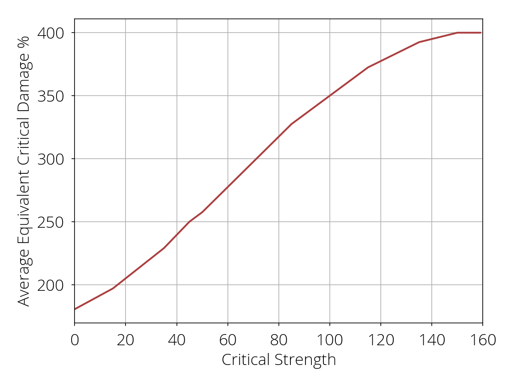
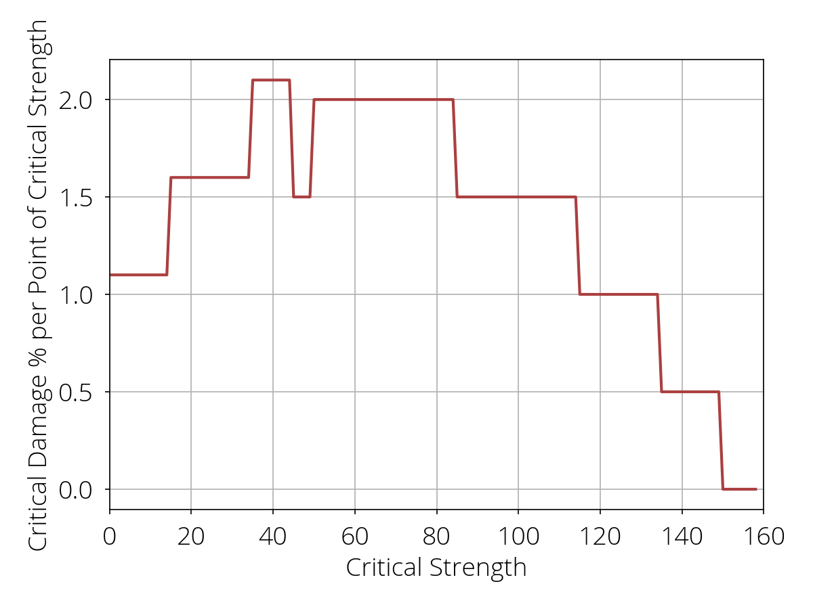

# Visualizing Critical Strength in 40K: Inquisitor

Critical damage in Warhammer 40K: Inquisitor - Martyr is a bit different than most systems.
Instead of a straight multiplier, there's an extra level of indirection.
The game internally rolls a random value from 1 to 100, adds your **critical strength** score, then looks up the value in a table.
While this has advantages (it smoothly caps crit strength stacking at the maximum value on the table), it also confuses new players often.

This simple script visualizes what "critical strength" means in terms of critical damage.
The first plot the average critical damage you can expect with a given amount of critical strength on your gear.
The second plot shows how much a single additional point of critical strength is assuming you already have a given amount.

